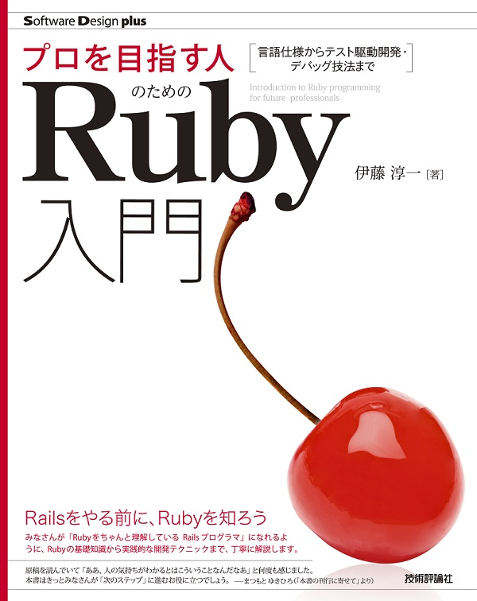

#  参考資料
##  ◆ 書籍紹介

 

### プロを目指す人のためのRuby入門 言語仕様からテスト駆動開発・デバッグ技法まで

### 概要
Rubyの文法をサンプルコードで学び，例題でプログラミングの流れを体験できる解説書です。
ほかのプログラミング言語で開発経験のある人が，Rubyを学ぶ際に効率的に学べる内容を詰め込みました。
プログラミング未経験者向けの「変数とは」「配列とは」といったプログラミング基礎知識の説明は最小限にし，そのぶんRubyの特徴（他プログラミング言語との違い），Rubyにおけるリファクタリングの要点，テスト駆動開発やデバッグのやり方など開発現場で必要になる知識を解説しています。
本書の内容を理解すれば，開発の現場で必要とされるRuby関連の知識を一通り習得できます。そして，「今まで呪文のようにしか見えなかった不思議な構文」や「実はあまりよくわからないまま，見よう見まねで書いているコード」も自信をもって読み書きできるようになるはずです。
本書はRuby 2.4をベースに解説します。Ruby 2.2や2.3など，少し前のバージョンで動きが異なる場合は，適宜注釈を入れています。

### おすすめ読者
- Rubyのプログラミングを学びたい人
- Rubyのテスト駆動開発やデバッグ技法を学びたい人
- Railsを学ぶにあたりまずはRubyを学びたい人

### 補足情報
以下のURLから本書著者が開設したサポートページに移動できます。このサポートページでは，本書で使用しているサンプルコードやRuby 2.5以降の変更点などを載せています。
- [本書著者によるサポートページ](https://ruby-book.jnito.com/)